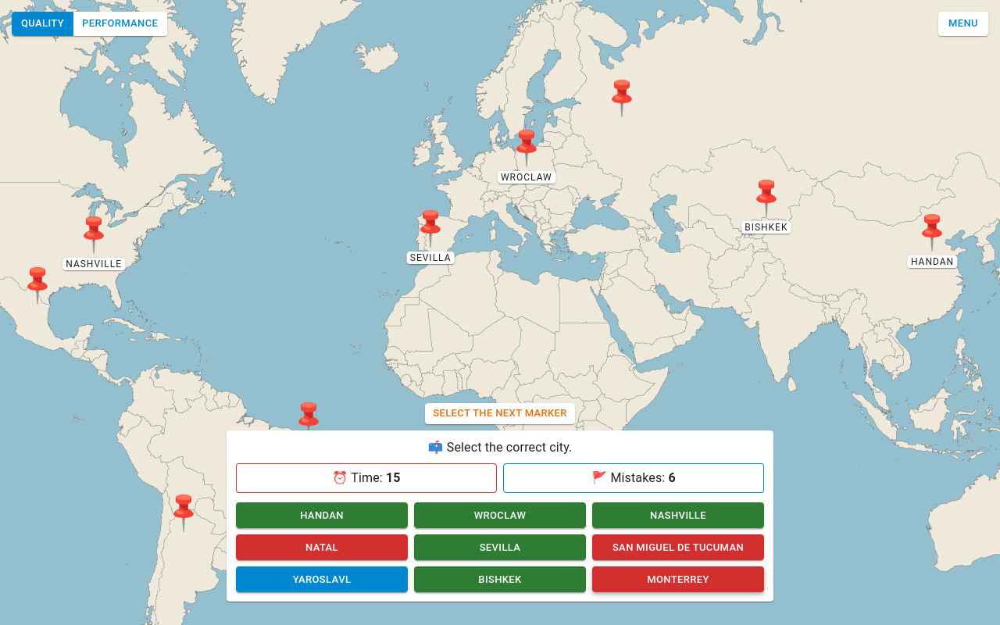

# Pin it! 📌️

**Pin it!** is a game in which the player must **assign drawn cities to markers** placed on the world map. **Time** is limited and only a few **mistakes** are allowed. Cities are drawn from a list of 1000 records.

The application is build in **React** and uses **Context API** + **Reducer** to manage data flow. The user interface components come from **MUI**.

## Explore the game

### [Check out the online demo.](https://mickrzyzak.github.io/pin-it-game/)

## Features

- Responsive web design
- Cities database
- Interactive map
- Gameplay tips
- Game timer
- Marker selection helper
- Quality/Performance mode
- Draw and spread mechanism
- Conversion of latitude and longitude to "flat position" in pixels

## Technologies

- [React](https://github.com/facebook/react) 18.2.0
- [MUI](https://github.com/mui/material-ui) 5.14.14

## Requirements

- Node.js and npm
- Browser _(Chrome recommended)_

## Setup

1. `npm install` Install Node dependencies
2. `npm start` Run the application
